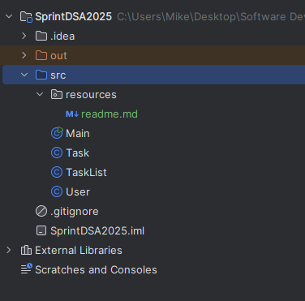

### Author

_Michael Barney_
#### Date: Nov 1, 2025

# To-Do List Manager

A simple Java application that demonstrates the use of arrays and single linked lists for managing user to-do lists.

### Project Overview

* Multiple users can be created and stored in an array
* Each user has their own to-do list implemented as a single linked list
* Users can add tasks, mark them as completed, and view all their tasks

### Features

1. ##### User Management

*    Create multiple users with unique names
*    Store users in an array
*    Each user maintains their own independent to-do list

2. ##### Task Management

*    Add tasks with descriptions to a user's to-do list
*    Each task has a completion status (pending or completed)
*    Tasks are stored in a custom single linked list implementation

3. ##### Mark Tasks as Completed

*    Mark tasks as completed by task description
*    Mark tasks as completed by position
*    Provides error when tasks are not found

4. ##### View Tasks

*    Display all tasks for a user with their completion status

### Project Structure

### Class Description

##### Task.java

- Purpose: Represents a single task in the to-do list
- Properties:

      description (String): The task description 
      isCompleted (boolean): Task completion status

- Methods:

      markAsCompleted(): Marks the task as completed
      getDescription(): Returns the task description
      isCompleted(): Returns the completion status

##### TaskList.java

- Purpose: Custom single linked list implementation for storing tasks 
- Inner Class: Node - represents each node in the linked list
- Properties:

      head (Node): First node in the list
      size (int): Number of tasks in the list

- Methods:

        addTask(Task task): Adds a task to the end of the list
        markTaskAsCompleted(String taskDescription): Marks task by description
        markTaskAsCompleted(int position): Marks task by position
        printAllTasks(): Displays all tasks with their status
        getSize(): Returns the number of tasks
        isEmpty(): Checks if the list is empty

##### User.java

- Purpose: Represents a user with their own to-do list
- Properties:

        name (String): User's unique name
        todoList (TaskList): User's single linked list of tasks

- Methods:

        addTask(String taskDescription): Adds a task to the user's list
        markTaskAsCompleted(String taskDescription): Marks task by description
        markTaskAsCompleted(int position): Marks task by position
        printAllTasks(): Displays all tasks for the user
        getTodoList(): Returns the user's TaskList

##### Main.java

- Purpose: Demonstrates the functionality of the to-do list manager

- Features Demonstrated:
1. Creating users and storing them in an array
2. Adding tasks to multiple users
3. Marking tasks as completed (by description and position)
4. Displaying all tasks for each user
5. Error handling for invalid operations
